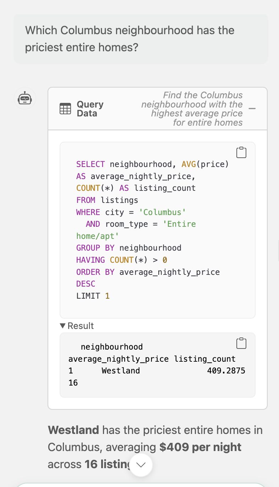
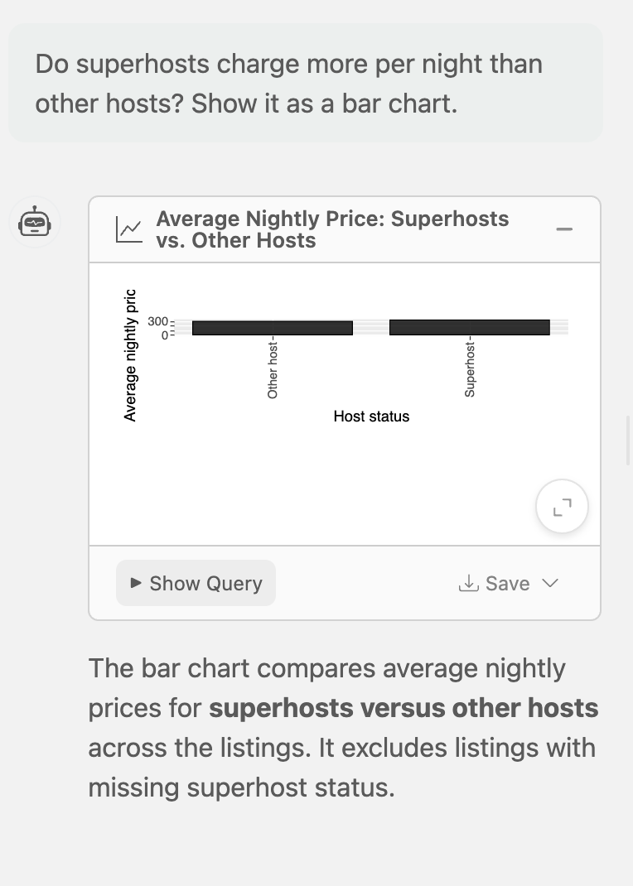
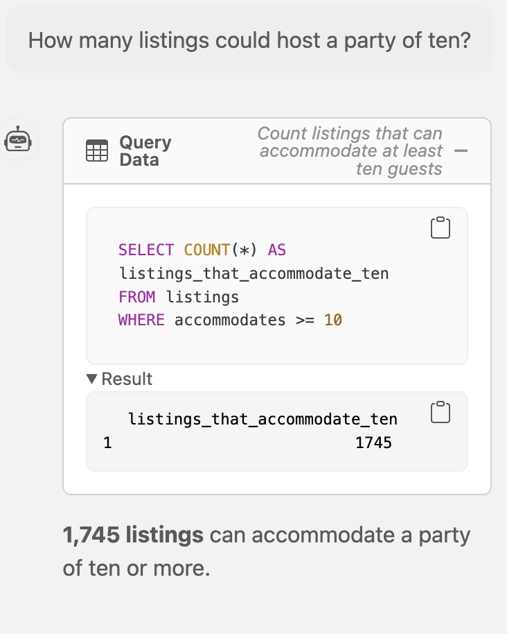

# Midwest Airbnb Explorer

**Ask a question in plain English about Midwest Airbnb listings, and get the SQL plus a table or chart back.**

**Live app:** https://midwest-airbnb-chat-6x4d.onrender.com

The app runs on Render's free tier, so it sleeps after 15 minutes without visitors. The first load can take about a minute.

---

## What is this app?

A [querychat](https://github.com/posit-dev/querychat) app built for ISA 401 (Business Intelligence) at Miami University. It connects to a SQLite database (`data/midwest_airbnb.db`) and hands the `listings` table to querychat, which uses an OpenAI model to turn questions into SQL. Only the column names and descriptions are sent to the model; the queries run on the app's own server, and the SQL behind every answer is shown in the app.

---

## Example questions

**Question 1:** Which Columbus neighbourhood has the priciest entire homes?

**Question 2:** Do superhosts charge more per night than other hosts? Show it as a bar chart.

**Question 3:** How many listings could host a party of ten?

---

## Dataset

- **Source:** Inside Airbnb (https://insideairbnb.com/get-the-data/), 14,887 listings: Chicago (snapshot 2026-07-20), Columbus (2026-07-23), and the Twin Cities (2026-07-21)
- **Data dictionary:** `data/data_desc.md` (all 29 columns)
- **Rules for the model:** `data/extra_instructions.md`

## Built by

Kenneth Kelley, ISA 401, Miami University